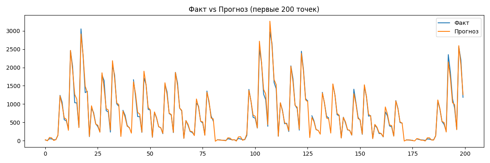
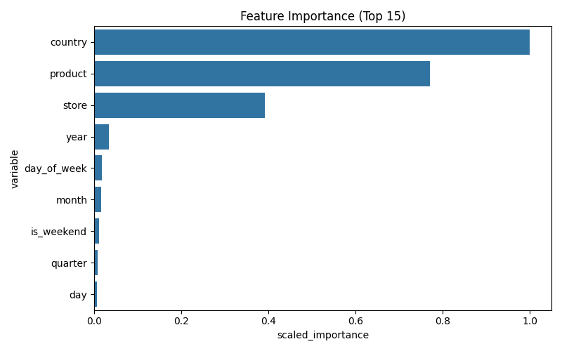

# Automation of ML Pipeline for Sales Forecasting
**Студент:** Осипов Роман Игоревич 
**Дисциплина:** Автоматизация машинного обучения  
**Преподаватель:** Елена Смысловских  
**Формат:** индивидуальная работа  
**Соревнование:** [Kaggle Playground Series S5E1 — Forecasting Sticker Sales](https://www.kaggle.com/competitions/playground-series-s5e1)

---

## 1. Описание бизнес-задачи

Цель проекта — построить и автоматизировать ML-пайплайн для прогнозирования объёма продаж стикеров по странам, магазинам и типам продуктов.

Бизнес-смысл: точный прогноз продаж позволяет:
- оптимизировать складские запасы и избегать дефицита или излишков
- планировать закупки заранее по каждому магазину и стране
- повышать эффективность логистики и снижать издержки

Тип задачи: **регрессия / прогнозирование временных рядов**  
Целевой признак: `num_sold` — количество проданных стикеров  
Метрика качества: **SMAPE** (Symmetric Mean Absolute Percentage Error)

---

## 2. Датасет

Источник: [Kaggle Playground Series S5E1](https://www.kaggle.com/competitions/playground-series-s5e1)

Синтетический датасет на основе реальных паттернов продаж. Содержит данные по 6 странам, 5 магазинам и 5 продуктам за период 2010–2019 гг.

| Признак | Описание |
|---|---|
| `date` | Дата продажи |
| `country` | Страна (Finland, Norway, Sweden и др.) |
| `store` | Магазин (KaggleMart, KaggleRama и др.) |
| `product` | Тип стикера |
| `num_sold` | Количество продаж (целевой признак) |

---

## 3. Архитектура ML-пайплайна

```text
Kaggle API
    ↓
Extract (download_data.py)
    ↓
Transform (etl.py)
    ├── Парсинг дат → year, month, day, quarter
    ├── day_of_week, is_weekend
    └── Label Encoding категориальных признаков
    ↓
Load → data/processed/ (Parquet)
    ↓
H2O AutoML (train.py)
    ├── GBM, Random Forest, Deep Learning, GLM
    └── Stacked Ensemble (лучшие модели)
    ↓
Оценка качества (evaluate.py)
    ↓
Сохранение модели + MLflow логи
```

---

## 4. ETL

Реализован в `src/etl.py`.

### Extract
Загрузка данных с Kaggle через API:
```bash
python -m src.download_data
```

### Transform
- Конвертация `date` в datetime
- Извлечение временных признаков: year, month, day, day_of_week, quarter, is_weekend
- Label Encoding для country, store, product

### Load
Сохранение обработанных данных в формате Parquet:
```bash
python -m src.etl
```

---

## 5. AutoML

Автоматизация реализована через **H2O AutoML**.

H2O AutoML автоматически:
- перебирает алгоритмы: GBM, Random Forest, Deep Learning, GLM
- подбирает гиперпараметры для каждой модели
- строит Stacked Ensemble из лучших моделей
- выбирает победителя по метрике RMSE на валидации

Запуск обучения:
```bash
python -m src.train
```

Лучшая модель: **GBM (Gradient Boosting Machine)**  
Все эксперименты логируются в MLflow.

---

## 6. Метрики модели

После обучения метрики сохраняются в `reports/tables/metrics.json`.

Лидерборд всех моделей AutoML: `reports/tables/leaderboard.csv`

---

## 7. Визуализации




---

## 8. MLflow

Логируются метрики, параметры и лучшая модель.

Запуск UI:
```bash
mlflow ui
```
Открыть: `http://127.0.0.1:5000`

---

## 9. Тестирование

Тесты реализованы через `pytest`.

```bash
pytest tests/ -v
```

Проверяется:
- добавление временных признаков после трансформации
- удаление колонки date
- отсутствие пропусков после ETL
- корректность кодирования категорий
- корректность расчёта метрики SMAPE

---

## 10. Docker

Сборка:
```bash
docker compose build
```

Запуск пайплайна:
```bash
docker compose up pipeline
```

Запуск MLflow UI:
```bash
docker compose up mlflow
```

Контейнер сохраняет результаты в локальные папки `models/`, `reports/`, `mlruns/` через volumes.

---

## 11. CI/CD

Реализован через **GitHub Actions** — файл `.github/workflows/ci.yml`.

При каждом push в `main` автоматически:
1. Устанавливается Python 3.13
2. Устанавливаются зависимости
3. Запускаются все тесты pytest
4. Собирается Docker-образ

Список git-команд использованных в проекте:
```bash
git init
git clone
git add .
git commit -m "message"
git push origin main
git pull
git rm -r --cached
git log
```

---

## 12. Мониторинг

### Мониторинг качества модели
- SMAPE и RMSE логируются в MLflow после каждого обучения
- Лидерборд всех моделей сохраняется в `reports/tables/leaderboard.csv`
- Графики предсказание vs факт: `reports/figures/predictions.png`
- Feature importance: `reports/figures/feature_importance.png`

### Мониторинг инфраструктуры
Скрипт собирает CPU и RAM во время работы:
```bash
python -m src.monitor
```
Результат: `reports/tables/resource_monitoring.csv`

---

## 13. Запуск проекта локально

```bash
# 1. Клонировать репозиторий
git clone https://github.com/Grobiks/Automation-of-ML-Pipeline-for-Sales-Forecasting.git

# 2. Создать и активировать виртуальное окружение
python -m venv venv
venv\Scripts\activate

# 3. Установить зависимости
pip install -r requirements.txt

# 4. Скачать данные
python -m src.download_data

# 5. Запустить ETL
python -m src.etl

# 6. Обучить модель
python -m src.train

# 7. Тесты
pytest tests/ -v

# 8. Мониторинг ресурсов
python -m src.monitor

# 9. MLflow UI
mlflow ui
```

---

## 14. Структура проекта

```text
.
├── .github/
│   └── workflows/
│       └── ci.yml
├── data/
│   ├── raw/
│   └── processed/
├── models/
├── reports/
│   ├── figures/
│   └── tables/
├── src/
│   ├── __init__.py
│   ├── config.py
│   ├── download_data.py
│   ├── etl.py
│   ├── evaluate.py
│   ├── monitor.py
│   ├── predict.py
│   └── train.py
├── tests/
│   ├── test_etl.py
│   └── test_train.py
├── Dockerfile
├── docker-compose.yml
├── README.md
└── requirements.txt
```

---

## 15. Выводы для бизнеса

Разработанный ML-пайплайн автоматизирует прогнозирование продаж стикеров:
- H2O AutoML самостоятельно подбирает лучший алгоритм без ручного тюнинга
- Docker обеспечивает воспроизводимость на любой машине
- CI/CD гарантирует что каждое изменение кода проходит тесты автоматически
- MLflow позволяет отслеживать качество модели и сравнивать эксперименты